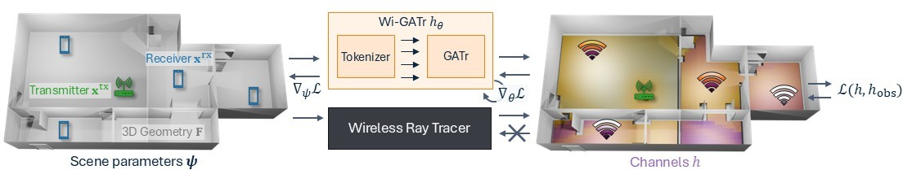

# Wi-GATr

This repository contains the official Wi-GATr (Wireless Geometric Algebra Transformer) implementation.
We provide code to train and evaluate the following:
- Supported models: Wi-GATr and Transformer regression models
- Supported datasets: Wi3R and WiPTR

The Wi-GATr model was proposed in the paper "Differentiable and Learnable Wireless Simulation with Geometric Transformers" by Thomas Hehn, Markus Peschl, Tribhuvanesh Orekondy, Arash Behboodi, and Johann Brehmer, published at ICLR 2025 (see citation below).
For the code to load the Wi3R and WiPTR datasets, please check the [WiInSim repository](https://github.com/Qualcomm-AI-Research/WiInSim).

## Paper abstract

> Modelling the propagation of electromagnetic wireless signals is critical for designing modern communication systems. Wireless ray tracing simulators model signal propagation based on the 3D geometry and other scene parameters, but their accuracy is fundamentally limited by underlying modelling assumptions and correctness of parameters. In this work, we introduce Wi-GATr, a fully-learnable neural simulation surrogate designed to predict the channel observations based on scene primitives (e. g., surface mesh, antenna position and orientation). Recognizing the inherently geometric nature of these primitives, Wi-GATr leverages an equivariant Geometric Algebra Transformer that operates on a tokenizer specifically tailored for wireless simulation. We evaluate our approach on a range of tasks (i. e., signal strength and delay spread prediction, receiver localization, and geometry reconstruction) and find that Wi-GATr is accurate, fast, sample-efficient, and robust to symmetry-induced transformations. Remarkably, we find our results also translate well to the real world: Wi-GATr demonstrates more than 35% lower error than hybrid techniques, and 70% lower error than a calibrated wireless tracer.




## Getting started

1. Clone the repository
   - `git clone https://github.com/Qualcomm-AI-Research/Wi-GATr`
1. Download the [Wi3R](https://softwarecenter.qualcomm.com/api/download/software/dataset/AIDataset/Wireless_Indoor_Simulations/Wi3R/Wi3R.zip) and/or [WiPTR](https://softwarecenter.qualcomm.com/api/download/software/dataset/AIDataset/Wireless_Indoor_Simulations/WiPTR/WiPTR.zip) place unpack them in a directory of your choice. This directory will now be referred to as `<PATH-TO-DATA>` as should contain at least either a `Wi3R` or `WiPTR` folder.

1. Setup the environment, either:

   A. Use `uv` on your host:
   - Install `uv` for dependency management if it is not already installed (follow [the official installation instructions](https://docs.astral.sh/uv/getting-started/installation/))
   - Sync the repository locally with `uv sync`

   or

   B. Use the build docker file which already includes `uv`:
   - `docker build -t wigatr -f docker/Dockerfile .`
   - `docker run --rm -it --gpus "all" --volume <PATH-TO-DATA>:<PATH-TO-DATA> wigatr bash`

Note: If you only want to use the datasets without training Wi-GATr, please take a look at [the WiInSim repository](https://github.com/Qualcomm-AI-Research/WiInSim).

### Train a regression model

Run the following training scripts where `<PATH-TO-DATA>` should point to a folder that contains the unpacked `Wi3R/` and `WiPTR/` folders.
```bash
uv run python scripts/train.py --config-name wigatr_wiptr data_root_dir=<PATH-TO-DATA>
```
Available configs: `wigatr_wiptr`, `wigatr_wi3r`, `transformer_wiptr`, `transformer_wi3r`.

### Run the evaluation script after training

You can run the evaluation without training by providing the experiment folder as an argument. The experiment folder should contain the `config.yaml` file and a saved model in `models/model_final.pt`.

For example if you've trained a model using the `wigatr_wiptr` config:
```bash
uv run python scripts/eval_regression.py --config-dir experiments/wi3r/wi-gatr
```

### Run Tx inference script

In addition to running the evaluation script, you can use the trained model to infer the transmitter location for a given scene and experiment directory.
```bash
uv run python scripts/infer_tx.py --config-name infer_tx_wi3r.yaml \
  "exp_dir=experiments/wi3r/wi-gatr" "scene=0"
```
Available configs: `infer_tx_wi3r`, `infer_tx_wiptr`.

### Test the setup: Overfit on the training set

You can overfit Wi-GATr on a small subset of the data to quickly test that all scripts are running as expected but without training the model properly.
We provide the data configs `wi3r_test_overfit` for that purpose.

This may look as follows and should take about 10 minutes and less than 12GB GPU memory to run.
```bash
# Train model
uv run python scripts/train.py \
  --config-name=wigatr_wi3r \
  data_root_dir=<PATH-TO-DATA> \
  data=wi3r_test_overfit \
  exp_name=wi3r_test \
  training.steps=1001 \
  training.eval_batchsize=16 \
  training.batchsize=16 \
  training.log_every_n_steps=25

# Eval model
uv run python scripts/eval_regression.py --config-dir experiments/wi3r_test/wi-gatr/

# Infer Tx
uv run python scripts/infer_tx.py \
  --config-name infer_tx_wi3r.yaml \
  exp_dir=experiments/wi3r_test/wi-gatr \
  scene=-4750 \
  steps=20
```

You should expect the following output:
- At the end of training, the MAE and RMSE should be below 1.0 for the splits `train`, `val`, `eval_rx_gen`, `eval_floor_gen`, `eval_rotation`, `eval_translation`, and `eval_reciprocity` as they all point to the training data.
- The output of `eval_regression.py` should match the results of `train.py` at the of training.
- `infer_tx.py` should result in a `Tx error:` < 1.0 for all number of measurements. Note: The negative scene index is a trick to run tx inference on the training data.

## Repository structure

```bash
Wi-GATr
├── config                      # Configs for ...
│   ├── data
│   │   ├── wi3r_test.yaml      # ... testing code small subset of Wi3R
│   │   ├── wi3r.yaml           # ... the Wi3R dataset
│   │   ├── wiptr_test.yaml     # ... testing code small subset of WiPTR
│   │   └── wiptr.yaml          # ... the WiPTR dataset
│   ├── infer_tx_wi3r.yaml      # ... the tx localization script on Wi3R
│   ├── infer_tx_wiptr.yaml     # ... the tx localization script on Wi3PTR
│   ├── transformer_wi3r.yaml   # ... training a transformer on Wi3R
│   ├── transformer_wiptr.yaml  # ... training a transformer on WiPTR
│   ├── wigatr_wi3r.yaml        # ... training Wi-GATr on Wi3R
│   └── wigatr_wiptr.yaml       # ... training Wi-GATr on WiPTR
├── pyproject.toml
├── README.md
├── scripts                     # Entrypoint scripts to ...
│   ├── __init__.py
│   ├── eval_regression.py      # ... evaluate trained models
│   ├── infer_tx.py             # ... infer transmitter location
│   └── train.py                # ... train models
├── setup.py
├── src
│   └── wigatr
│       ├── data                # Data loading and preprocessing
│       │   ├── __init__.py
│       │   ├── geometric.py
│       │   ├── utils.py
│       │   └── visualization.py
│       ├── __init__.py
│       ├── experiments         # Training and evaluation logic
│       │   ├── __init__.py
│       │   ├── base_experiment.py
│       │   ├── regression.py
│       │   └── utils.py
│       ├── models              # Model implementations
│       │   ├── __init__.py
│       │   ├── regression_gatr.py
│       │   └── regression_transformer.py
│       └── utils               # Utility functions
│           ├── __init__.py
│           ├── affine.py
│           ├── augment_and_canonicalize.py
│           ├── logger.py
│           ├── misc.py
│           ├── plotting.py
│           └── tensors.py
├── tests
│   ├── gatr4wi
│   │   ├── __init__.py
│   │   └── models
│   │       └── test_equivariance.py
│   └── __init__.py
└── uv.lock                     # Exact versions of dependencies
```

## Citation

```text
@inproceedings{
  wigatr,
  author = {Hehn, Thomas and Peschl, Markus and Orekondy, Tribhuvanesh and Behboodi, Arash and Brehmer, Johann},
  booktitle = {International Conference on Representation Learning},
  editor = {Y. Yue and A. Garg and N. Peng and F. Sha and R. Yu},
  pages = {45353--45373},
  title = {Differentiable and Learnable Wireless Simulation with Geometric Transformers},
  url = {https://proceedings.iclr.cc/paper_files/paper/2025/file/70596d70542c51c8d9b4e423f4bf2736-Paper-Conference.pdf},
  volume = {2025},
  year = {2025}
}
```

## License

Wi-GATr is licensed under the [BSD-3-clause License](https://spdx.org/licenses/BSD-3-Clause.html). See [LICENSE](LICENSE) for the full license text.

